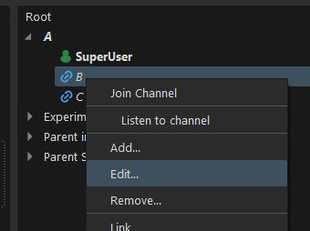
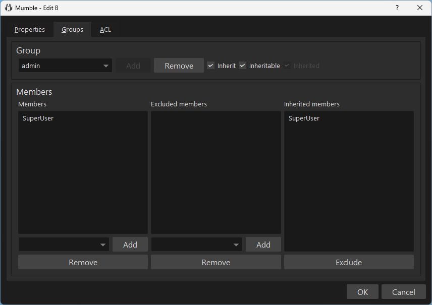
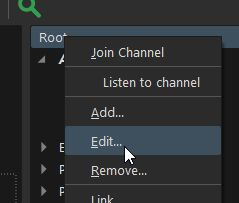
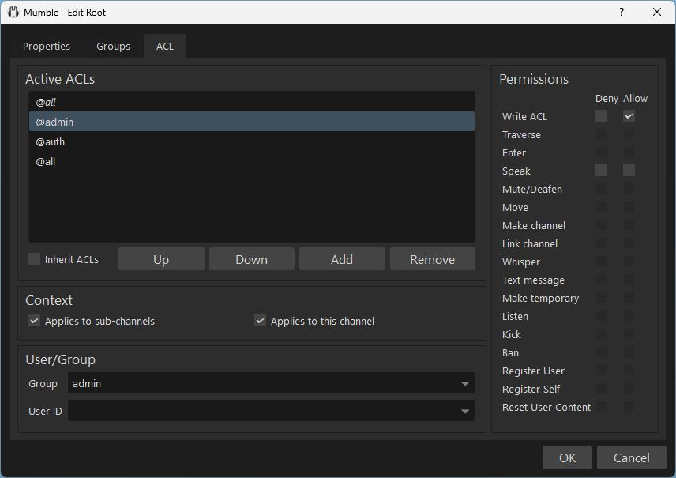
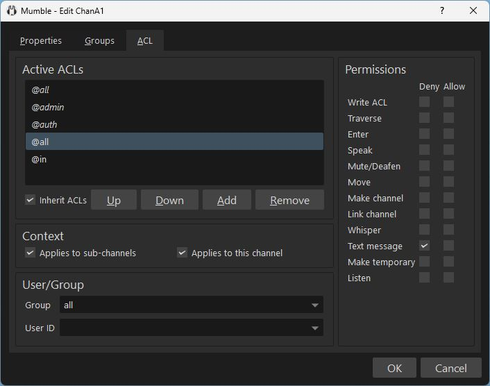
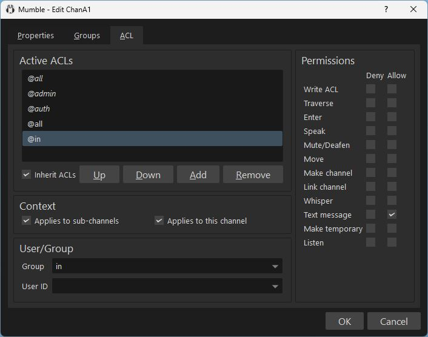

For the configuration of permissions, Mumble uses ACLs (Access Control Lists). A rule may apply to a user or group of users and may give or revoke permissions.

While the Group and ACL dialogs might seem complex at first, for simple configuration much of their complexity can be ignored.
The high configurability can be used for advanced and complex use cases.

## Table of Contents



## Edit Dialog

Groups, group members, and ACL rules are configured in the channel edit dialog.

If you have the **"Write ACL" permission** you can open the channel edit dialog in the context menu *(right-click)*.



*For initial setup, before you have given anyone permission, you will need to authenticate as the administrative SuperUser account. On first server startup the password is logged in `mumble-server.log` as `<W>2023-03-19 08:37:04.319 1 => Password for 'SuperUser' set to 'xxxxxx'`.*

## Channels, Groups and ACL

Groups and permissions are configured on channels. Channels inherit groups and rules by default. Groups can be used for grouping users into user roles. ACL rules are used to give or deny users or groups of users permissions on a channel.

### User Groups

In the *Groups* tab, you can see and edit the user groups of the channel.



For a simple configuration, you will edit user groups on your servers root channel (the top-level, outer-most channel) and inherit these groups to all channels.



To describe the default permission setup we refer to the following example channel tree:

```text
Root
├── ChannelA1
│   ├── ChannelA11
│   ├── ChannelA12
│   └── ChannelA13
└── ChannelB
```

By default

* the `Root` channel defines an `admin` group
  * the `admin` group is inheritable
* the other channels inherit the `admin` group

#### Advanced User Groups

Because user groups can be defined in channels you can define separate user groups for different channel sub trees, individual channels, or influence who is a member of a group in the context of different channels.

For example, to have different moderators users in separate channel trees, given the following channel setup

```text
Root
├── ChannelA1
│   ├── ChannelA11
│   ├── ChannelA12
│   └── ChannelA13
└── ChannelB
```

we can define a group `moderatorA` in `ChannelA1` and a group `moderatorB` in `ChannelB`.

We may also define a group `userA` in `ChannelA1` and a group `userB` in `ChannelB` intending to only allow `userA` members to enter `ChannelA1` and its children, while only allowing `userB` members to enter the `ChannelB` channel.

## ACL rules

ACL rules are configured in the ACL tab of the channel edit dialog.


The Access Control *List* can have multiple rules. Rules may be inherited from parent channels - displayed in italics - or defined on the edited channel.


Permission are evaluated from top to bottom. (*Allow* and *deny* may be overwritten further down.)

### Selector

A rule consists of a selector and permission actions.

The **selector defines who the rule applies to** - a user, user group. It may use a prefix to indicate its type or modify its select-behavior.

| Prefix | Prefix-Type   | Description                                      | Example                        |
| ------ | ------------- | ------------------------------------------------ | ------------------------------ |
| *none* | Id-Type       | User                                             | `User1`, `John Doe`            |
| `@`    | Id-Type       | Group                                            | `@admin`, `@all`, `@moderator` |
| `@#`   | Id-Type       | Channel password / Access Token                  | `@#secret`, `@#u8DhwG2`        |
| `~`    | Eval-Locality | Evaluate in context of definition                | `@~sub 1,1`, `@~moderator`     |
| `!`    | Inversion     | Invert the meaning of the rest of the selector   | `!TrustedUser`, `!@moderator`  |

### Permission Allow/Deny

The permission actions can allow or deny a permission. If the rule neither allows nor denies a permission it does not influence the top-to-bottom permission evaluation.

### Rule Examples

For example, given the following channel setup

```text
Root
├── ChannelA1
│   ├── ChannelA11
│   ├── ChannelA12
│   └── ChannelA13
└── ChannelB
```

`@admin` defined on channel `Root` with *Allow* `Write ACL` will give members of the `admin` group all permissions.



### Meta Groups

Meta groups can be used in ACL rules. Meta groups have implicitly defined members. The members are determined by user state.

| Group    | Description         | Notes          |
| -------- | ------------------- | -------------- |
| `@all`   | Applies to everyone                  | Useful for default permissions or for clearing complex rules to a well defined state. |
| `@in`    | In this channel                      |  |
| `@out`   | Outside of this channel              |  |
| `@~sub`  | Sub-channel - `@~sub,a,b,c`          |  |

#### `in` Group

Given a channel tree

```text
Root/
├── ChannelA1
│   ├── ChannelA11
│   ├── ChannelA12
└── ChannelB
```

To deny users outside of ChanA1 to send text messages to it, but allow users inside of it to send text messages, we add two rules.

* *Deny* *Text message* to `@all`
* *Allow* *Text message* to `@in`

Now users in `Root`, `ChanA11`, `ChanA12`, ChanB can not send text messages to ChanA1. But users inside of ChanA1 can.





The rule is inherited into `ChanA11` and `ChanA12`. But it applies as a rule within each of those  channels individually. So users outside of `ChanA11` can not send text messages to `ChanA11`, but users inside of it can. Users outside of `ChanA12` can not send text messages to `ChanA12`, but users inside of it can.

If we define the second rule [on `ChanA1`] as `@~in` instead of `@in` then the inherited rule in `ChanA11` and `ChanA12` is interpreted in the context of `ChanA1`. That means that a user in `ChanA1` will be able to send text messages to `ChanA1`, `ChanA11`, and `ChanA12`. But a user not in `ChanA1` can not. Users in `ChanA11` and `ChanA12` will also not be able to send text messages to `ChanA1`, `ChanA11`, and `ChanA12`.

#### `out` Group

An `@out` meta group is the inverse of the `@in` meta group. This means that you can solve the same tasks alternatively with `in` or `out`, and inverse *allow* and *deny*.

For example:

* `@in` approach: *deny `@all`*, *allow `@in`*
* `@out` approach: *allow `@all`*, *deny `@out`*

#### `sub` Group

The `sub` group applies to subchannels and has three optional parameters `a,b,c`. It is written as `@~sub` or `@~sub,a` or `@~sub,a,b` or `@~sub,a,b,c` where `a`, `b`, and `c` are integer numbers.

Because the `sub` group applies to a channel tree the rule only makes sense with a `~` tilde modifier (`@~sub`).
Without the `~` tilde the context in which the ACL is evaluated in is always the current channel, which would mean no children or parents would ever be considered.

| Parameter | Description                      | Default |
| --------- | -------------------------------- | ------- |
| a         | minimum number of common parents | `0`     |
| b         | minimum child path depth         | `1`     |
| c         | maximum child path depth         |         |


Given the channel tree

```text
ChanA
└── ChanB
    └── ChanC
```

| Selector      | On channel | Applies to user in        |
| ------------- | ---------- | ------------------------- |
| `@~sub,0,0`   | `ChanA`    | `ChanA`, `ChanB`, `ChanC` |
| `@~sub,0,1`   | `ChanA`    |          `ChanB`, `ChanC` |
| `@~sub,0,2`   | `ChanA`    |                   `ChanC` |
| `@~sub,0,0,0` | `ChanA`    | `ChanA`                   |
| `@~sub,0,0,1` | `ChanA`    | `ChanA`, `ChanB`          |
| `@~sub,0,0,2` | `ChanA`    | `ChanA`, `ChanB`, `ChanC` |
| `@~sub,0,1,1` | `ChanA`    |          `ChanB`          |
| `@~sub,0,2,2` | `ChanA`    |                   `ChanC` |

In other words, `b` and `c` define the child depth span (children of `b`-th to `c`-th depth).

Laid out in a different form:

```text
Channel Tree:   ChanA / ChanB / ChanC
@~sub,0,1                 x       x           a=0: no sibling logic, b=1 start one level below the current channel, c empty: no depth limit
@~sub,0,1,1               x                   a=0: no sibling logic, b=1 start one level below the current channel, c=1: end one level below the current channel (inclusive)
```

##### `sub` Example 1

Given the channel tree

```text
ChanA
└── ChanB
    └── ChanC
```

A `@~sub` rule (equivalent to `@~sub,0,1`) on `ChanA` applies to users in `ChanB` and `ChanC` but gives permission on `ChanA`.

For example, if *Text message* is *denied* on `ChanA`, but a `@~sub` rule on `ChanA` allows *Text message*, a user in `ChanB` or `ChanC` can send text messages to `ChanA`. A user in `ChanA` can not send a text message to `ChanA`.

For example, with two rules on `ChanA`

* `ChanA`: `@all` *Deny* *Text message*
* `ChanA`: `@~sub` *Allow* *Text message*

=>

* `ChanA`: user can not send text message to `ChanA`
* `ChanB`: user can send text message to `ChanA`
* `ChanC`: user can sent text message to `ChanA`

### Evaluation Locality

Given the channel tree

```text
ChanA
└── ChanB
    └── ChanC
```

Defining an ACL rule `@in` on `ChanA` that inherits to subchannels means it *exists* in `ChanA` as well as its children `ChanB1` and `ChanB2`.
Therefore, when checking this ACL inside e.g. `ChanB2` it acts as if it had been defined on it (aka: the evaluation of the ACL does not know that the original ACL was defined on `ChanA`).

Defining an ACL rule `@~in` on `ChanA` that inherits to subchannels means it applies to `ChanA` as well as its children `ChanB1` and `ChanB2`.
But this time the evaluation of the ACL _does_ know that the ACL is defined in the context of `ChanA` and therefore `@~in` only refers to users in `ChanA`.


For example:

If `ChanA` has `@all` *deny* *text message* and `@in` *allow* *text message* then

* users in `ChanA` can only send text messages to `ChanA`
* users in `ChanB1` can only send text messages to `ChanB1`
* users in `ChanB2` can only send text messages to `ChanB2`

If `ChanB` has `@all` *deny* *text message* and `@~in` *allow* *text message* then

* users in `ChanA` can send text messages to `ChanA`, `ChanB1`, `ChanB2`
* users in `ChanB1` or `ChanB2` can not send text messages

## Linking Channels

Linked channels share communication. Connecting channels and then restricting which users can do what in which channels is a versatile approach for configuring complex permission behavior.

## Testing with multiple clients

The Mumble client by default ensures only one instance is running [on a system], and loads user configuration with a user certificate.
You can work around this with the `-m` and `-n` launch parameters (`mumble.exe -n -m`).

This allows you to edit ACL with one client (normal launch, login as SuperUser or admin user), and test your ACL one or multiple unauthenticated clients.
