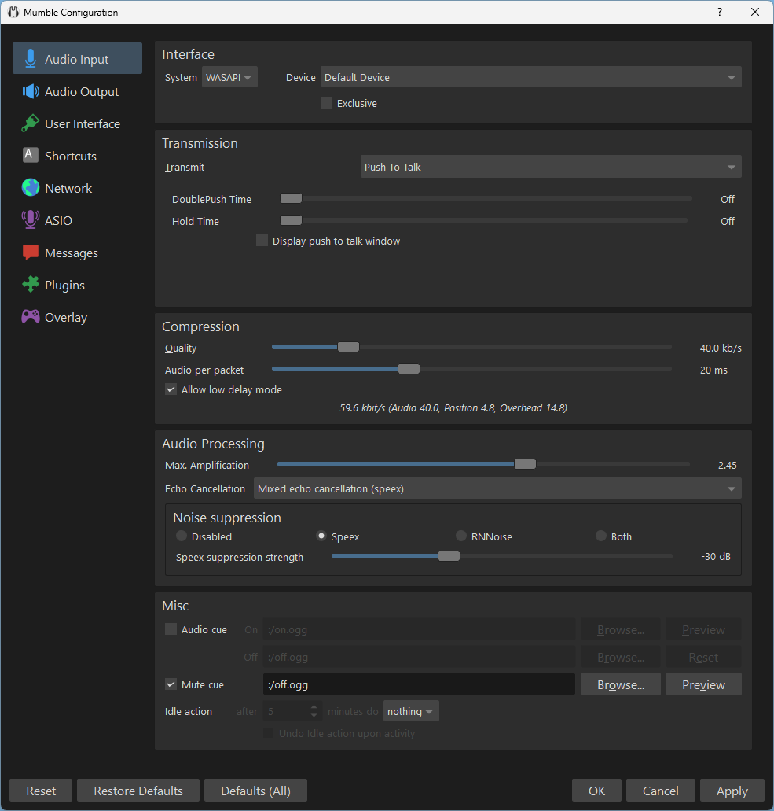
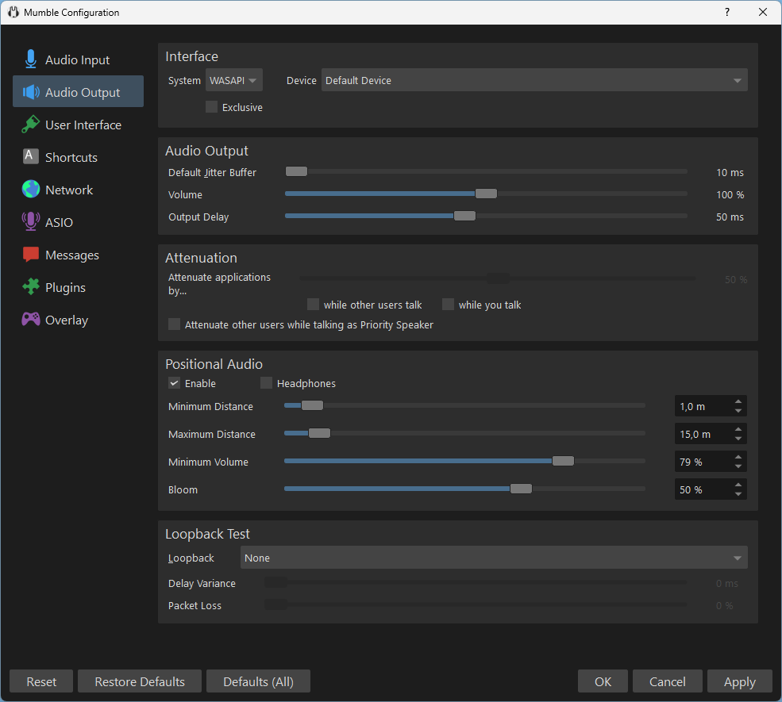

The Mumble settings window can be opened through the menu items Configure -> Settings.

In the settings dialog window the Audio Input and Audio Output sections provide options to customize audio input and output behavior.

## Audio Input

### Interface

* System: The sound system between the audio device driver and applications. For Windows, this is typically WASAPI. On Linux it may be Pulseaudio. Alternatives can be JACK and ASIO.
* Device: *Default Device* will use the system's currently set default device.\
  Users would typically set the system default device to the one they use. In such cases, there is no need to set a specific device.
* Exclusive: Give Mumble exclusive access to the microphone. This means no other application will be able to use it while Mumble is running. In turn, Mumble will immediately receive all incoming input audio data.\
  For most users, this setting is not necessary and can lead to confusion if other applications can not use a microphone.

### Transmission

* Transmit: How Mumble determines which audio to potentially transmit. *(Audio Processing conditions apply; see the respective section)*
  * Voice Activity: The user's voice shall be transmitted. Which incoming audio is a voice can be determined through an *amplitude* (loudness) or *Signal to Noise ratio* approach.
  * Push To Talk: Transmit through explicit key presses.\
    Most users will use a "transmit while holding the talk key" approach. If enabled, a double press can keep transmission active until canceled. The hold time can extend how long transmission remains active when you let go of the press.
  * Continuous: Incoming input audio will always be transmitted.\
    Most users will not want to use this mode. Continuous would often transmit background noise, speaker audio output, or other unintended sound and voice/talk.

### Compression

The compression settings allow you to influence the weighing between audible audio quality, latency, and bandwidth use.

* Quality: kb/s to use - higher means higher audio quality - not necessarily audible in not-low ranges
* Audio per packet: The physical continuous audio is packaged into transferred packages of this size. Lower means lower delay at the cost of bandwidth use. Higher means higher delays but lowered bandwidth use.\
  Note that some audio device drivers have issues with very small 10 ms audio packets. Using 20 ms gives a very low delay without the risk of audible audio device driver issues. See also Audio Output Jitter Buffer setting.
* Allow low delay mode: This only applies to audio with Quality 64 kb/s or higher. This is an Opus audio codec setting. Reduces latency by ~15 ms. May require higher Quality bitrate to preserve the same audio quality.

### Audio Processing

* Maximum Amplification: If your microphone input volume is too low Mumble amplifies it in an attempt to volume normalization (so others can hear you clearly). See the extended help for more information (? in Window and click, or when focused SHIFT+F1).
* Echo Cancellation: Attempt to identify when others talking is picked up through the Microphone again. (Echo is common with a speaker setup. Not so much with headphones, although bad insulation with close proximity of the microphone vs output cables can lead to echo.)
  * Disabled: Do not use echo cancellation
  * Mixed: Mixed has low CPU impact, but only works well if the speakers are equally loud - when you sit/your microphone in the center of multiple speakers.
  * Multichannel: Much better echo cancellation than *Mixed* at the cost of CPU usage.
* Noise Suppression: Attempt to identify noise / background noise and filter it out.
  * Disabled
  * Speex: Algorithm approach, provided by Speex / the Speex codec.
  * RNNoise: Recurrent neural network for audio noise reduction *([GitHub project reference](https://github.com/xiph/rnnoise), [Mozilla Research announcement](https://hacks.mozilla.org/2017/09/rnnoise-deep-learning-noise-suppression/))*
  * Both

### Misc

* Audio cue: Use sounds - default or your own selection - to indicate that audio transmission becomes active or inactive.\
  When using push-to-talk lack of sound cues can help you notice when you intend to talk but are muted.\
  When using voice activation the lack of sound cues can help you notice being muted or voice activation levels not identifying correctly when you talk (due to different microphone or head position or settings that need adjustments for quite voice etc).
* Mute cue: Play a sound when Mumble would transmit audio (push-to-talk or voice activation) but you are currently muted.
* Idle action: Automatically mute or deafen yourself when inactive for a specified amount of time.

## Audio Output

### Interface

* System: The sound system between the audio device driver and applications. For Windows, this is typically WASAPI. On Linux it may be Pulseaudio. Alternatives can be JACK and ASIO.
* Device: *Default Device* will use the system's currently set default device.\
  Users would typically set the system default device to the one they use. In such cases, there is no need to set a specific device.
* Exclusive: Give Mumble exclusive access to the audio device. This means no other application will be able to use it while Mumble is running. In turn, audio Mumble puts out will immediately be passed on by the audio system.\
  For most users, this setting is not necessary and can lead to confusion if other applications can not use the audio device.

### Audio Output

* Default Jitter Buffer: Before playback collect this amount of incoming audio to reduce jittery audio. Lower reduces latency. If you hear audible jitter when people start talking then increase this value.
* Volume: Output Volume: Most users will use their OS / sound system volume settings to adjust volume - even for individual applications. Otherwise, this setting can be used to adjust Mumbles output volume.
* Output Delay: Amount of audio time to buffer before output. Lower reduces latency. Too low (for the audio driver or device) may cause audible rapid jittering. If that is the case, increase it.

### Attenuation

With attenuation, Mumble can adjust the volume of other applications while you or others or Priority Speakers talk.\
This is intended to reduce noise being picked up while you talk, and you being able to hear others talking better over other audio playback.

### Positional Audio

When enabled and when in-game with others, [Positional Audio]() allows you to hear them from the direction and distance they are in in-game.

When people stand right next to you will hear them at full volume. The bloom setting defines how much directional audio blooms into other directions. If they stand to your right, the bloom will make it so you also hear a bit of them to your left. (Which makes sense when they are very close.)

Through minimum and maximum distance you can configure how the volume behaves relative to distance. People closer than the minimum distance are full volume. People at maximum distance are at minimum volume.

Most users will want a minimum volume so they can hear people talking even if they are far away in the game world. Setting the minimum volume to 0 % means you will not hear them when they are farther than the maximum distance away.

## Loopback Test

Used for testing.

* Local: Audio input that would be transmitted to others is played back to you locally. Useful for testing and verifying input and output settings. (Can you hear yourself? Is the volume fine?)
* Server: Audio input that would be transmitted to others is sent to the server and back. With *Local* verified, useful for testing networking. (Are my network packets being lost? Between me and the server?)

When you verified both Local and Server loopbacks work fine for you, others not hearing you must be on them (or an advanced permission system).

As an additional note: Others light up when you receive their audio data. This can be a useful indicator of whether data is received fine.
