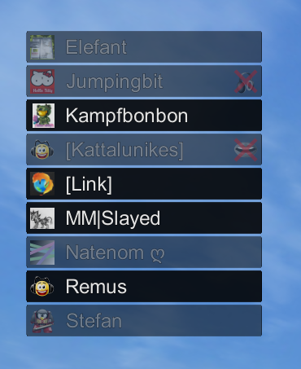

Mumble can show information within rendered applications; most notably videogames which are typically used with full screen rendering.

Mumble can show connected and/or talking voice participants as well as current FPS and/or the clock time.

The overlay can give users feedback about who is connected or who is talking when the application would otherwise obscure this information. Even if the user has Mumble open on a second monitor, the overlay may be a useful addition as it can be placed freely on the primarily focused on monitor.

Mumble hooks into 3D rendering technology. On **Windows** it currently **supports Direct3D 9/10/11 and OpenGL**. On **Linux and macOS** it supports **OpenGL**. Both 32- and 64-bit applications are supported.

## Support Tables

<table>
<caption><b>Windows</b> <i>x64 (64-bit) Applications</i></caption>
<thead>
<tr><th>API</th>         <th>Support</th></tr>
</thead>
<tbody>
<tr><td>Vulkan</td>      <td style="color: #338833;">since 1.3.0</td></tr>
<tr><td>OpenGL</td>      <td style="color: #338833;">since 1.3.0</td></tr>
<tr><td>Direct3D 12</td> <td style="color: #883333;">does not display</td></tr>
<tr><td>Direct3D 11</td> <td style="color: #338833;">since 1.3.0</td></tr>
<tr><td>Direct3D 10</td> <td style="color: #338833;">since 1.3.0</td></tr>
<tr><td>Direct3D 9ex</td><td style="color: #338833;">since 1.3.0</td></tr>
<tr><td>Direct3D 9</td>  <td style="color: #338833;">since 1.3.0</td></tr>
</tbody>
</table>

<table>
<caption><b>Windows</b> <i>x86 (32-bit) Applications</i></caption>
<thead>
<tr><th>API</th>         <th>Support</th></tr>
</thead>
<tbody>
<tr><td>Vulkan</td>      <td style="color: #338833;">since 1.3.0</td></tr>
<tr><td>OpenGL</td>      <td style="color: #338833;">supported</td></tr>
<tr><td>Direct3D 12</td> <td style="color: #338833;">does not display</td></tr>
<tr><td>Direct3D 11</td> <td style="color: #338833;">supported</td></tr>
<tr><td>Direct3D 10</td> <td style="color: #338833;">supported</td></tr>
<tr><td>Direct3D 9ex</td><td style="color: #338833;">supported</td></tr>
<tr><td>Direct3D 9</td>  <td style="color: #338833;">supported</td></tr>
</tbody>
</table>

<table>
<caption><b>Linux and macOS</b> <i>x64 + x86 (64- and 32-bit)</i></caption>
<thead>
<tr><th>API</th>         <th>Support</th></tr>
</thead>
<tbody>
<tr><td>Vulkan</td>      <td style="color: #338833;">since 1.3.0</td></tr>
<tr><td>OpenGL</td>      <td style="color: #338833;">supported</td></tr>
</tbody>
</table>

### Incompatible Games

The following games are known to have issues with the Mumble overlay:

<table>
<thead>
<tr><th>Game</th><th>Last Updated</th><th>API</th><th>Comments</th><th>Fixed in</th></tr>
</thead>
<tbody>
<tr><td>Combat Arms</td>     <td>unknown</td><td>overlay causes CA to crash after map changes; overlay will not display unless one joins a server and then leaves it</td><td>unknown</td></tr>
<tr><td>Vanguard</td>        <td>unknown</td><td>crashes to desktop when overlay is enabled</td><td>unknown</td></tr>
<tr><td>Call of Duty 4</td>  <td>unknown</td><td>PunkBuster kick playing online</td><td>unknown</td></tr>
<tr><td>Call of Duty 2</td>  <td>unknown</td><td>PunkBuster kick playing online</td><td>unknown</td></tr>
<tr><td>Killing Floor</td>   <td>unknown</td><td>the game will crash when changing resolutions or going into fullscreen mode</td><td>unknown</td></tr>
<tr><td>Red Orchestra</td>   <td>unknown</td><td>the game will crash when changing resolutions or going into fullscreen mode</td><td>unknown</td></tr>
<tr><td>H1Z1</td>            <td>unknown</td><td>game crashes at startup</td><td>unknown</td></tr>
</tbody>
</table>
