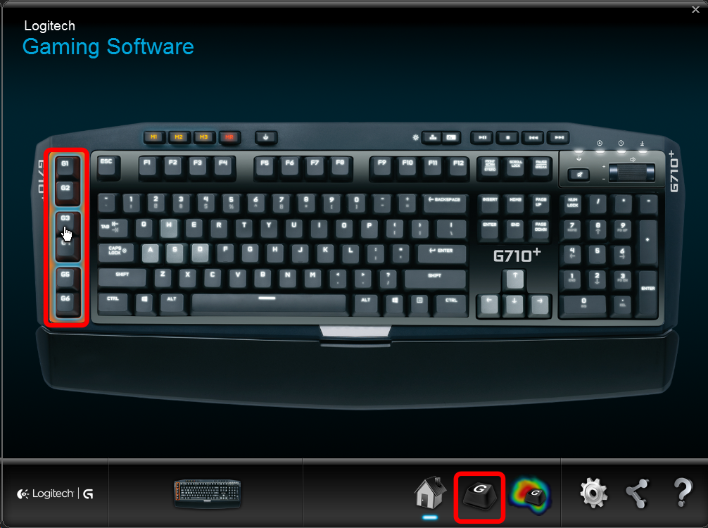
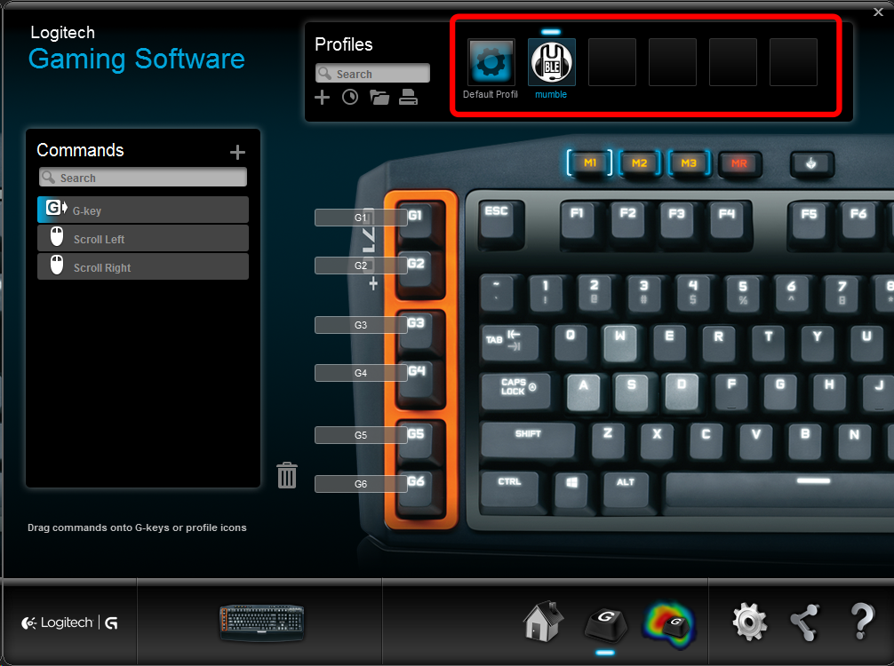
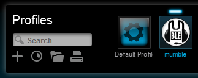
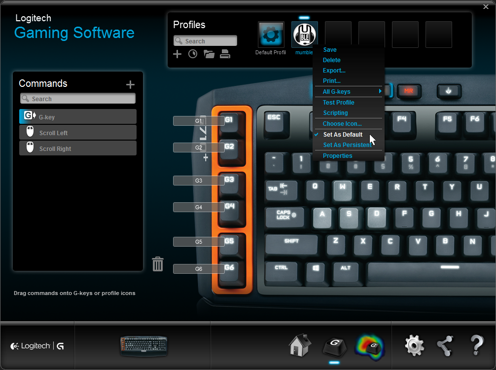
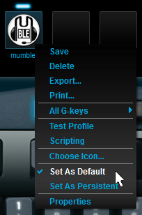
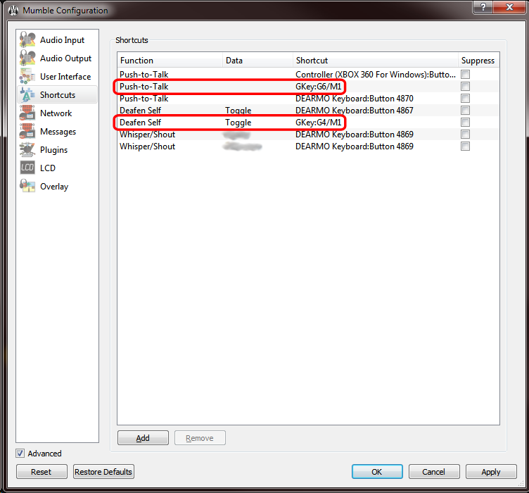

+++
title = "Logitech G-Keys"
+++
The G-keys available on many Logitech keyboards can be used as keyboard shortcuts in Mumble 1.3.0 and later.

## First-time setup

Install the [Logitech Gaming Software (LGS)](http://support.logitech.com/en_ca/software/gaming-software).

If it is already installed, ensure it is at least version 8.55.

1\. Launch LGS

2\. Launch or restart Mumble.

3\. Open the LGS window

5\. Open the G-keys view

6\. You should see that a "mumble" profile has been created

7\. Right click the mumble profile and select **"Set as Default"** or **"Set as Persistent"**.

This is required due to limitations of the Logitech G-key API, since it was designed for use only with games in mind.

*We recommend setting the mumble profile as default.*

*For more information, see "What are persistent and default profiles?" in the LGS help by clicking on the "?" icon on the LGS window, or in [the online manual (PDF)(page 54)](http://www.logitech.com/assets/51813/3/lgs-guide.pdf).*

*If mumble is not set as the default or persistent profile, then your keys will not be active unless mumble is the active window.*

8\. In Mumble, you should now be able to set G-keys as your shortcut keys

