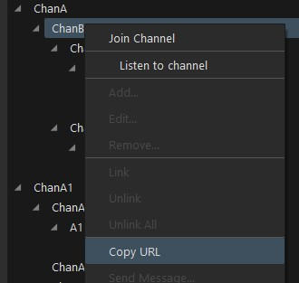

Mumble defines it's own `mumble://` URL scheme to share links to servers and channels and to be able to connect to them directly.

On Windows the installer will register `mumble://` links to be opened with Mumble.

Mumble links can be opened on the command line by passing them to mumble.exe too:

```
mumble.exe mumble://example.com/
```

or with a channel path:

```
mumble.exe mumble://example.com/ChanA/ChanB
```

You can get get a URL in the Channel context menu (right click):



## Connect Behavior

When opening a Mumble link the Mumble client will connect to the server.

* If you are already registered you will connect with your account
* If the URL contains a username that username will be used
* If no username is determined, the client will ask with what name you want to connect with

## URL Format

```
mumble://[username[:password]@]<address>[:port]/[channelpath][?title=<servername>][&url=<serverurl>]
```

* optional `username` and `password`
* mandatory `address`; a hostname, IPv4, or IPv6 address
* optional `port`; defaults to 64738
* optional `channelpath`; specifies a channel subtree to join; special characters must be [URL-encoded](https://en.wikipedia.org/wiki/URL_encoding); if the Mumble client can join the server but not the channel it will stay in the default channel
* optional `servername` and `serverurl`; only used if the user drags the link and drops it in the server browser in Mumble for filling the server name and URL

"Special" non-ASCII characters must be %-encoded. Most utilities should do this for you. For more information see [Wikipedia - URL encoding](https://en.wikipedia.org/wiki/URL_encoding).

Simple form:

```
mumble://<address>:<port>/
```

Examples:

```
mumble://mumble.example.com/
mumble://172.16.31.199/
mumble://example.com:23840/
mumble://172.16.31.199:2000/
```

## Server Password

A server password can be specified without a username:

```
mumble://:mypassword@example.com/
```

## URL Handler Installation

A manual handler installation should not be necessary for normal users.

### Linux Gnome

```bash
gconftool-2 -s -t string /desktop/gnome/url-handlers/mumble/command 'mumble "%s"'
gconftool-2 -s -t bool /desktop/gnome/url-handlers/mumble/enabled true
```

If the `mumble` command is not globally accessible through the `PATH` environment variable you must specify the full path to the mumble executable.

## version parameter

```
mumble://mumble.example.com/?version=1.2.0
```

The `version` parameter is only necessary for client installations prior to the long-past Mumble version 1.2.4.
Note that 1.2.0 stands for the protocol and will work for any client and server with higher versions too.

Mumble 1.2.0 introduced a protocol incompatibility which made it necessary for links to differentiate between a pre-1.2.0 server and a 1.2.0 (and above) server. The linked server would then be opened in the pre-1.2.0 compatibility client or the new client.

Since version 1.2.4 - released in 2014 - URLs without the `version` attribute are considered to be for the new protocol.

We do not expect such very old clients or servers to still be in use. We suggest you not include the `version` parameter for simpler URLs.
