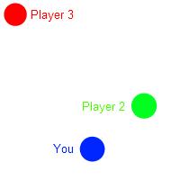

**Please note that Mumble works with all games as a regular voice chat application.**

This page documents the positional audio (“PA”) feature specifically, where you hear participating users according to their position in your game world.

## What is Positional Audio

Positional Audio is a feature of Mumble that places the people talking to you in a certain position relative to your own depending on their actual position in the game you are playing. This way you can hear the person as if their actual avatar in-game was talking to you.

If someone is NOT using Positional Audio, you hear them normal, not from a specific direction or location.

If someone uses Positional Audio, and is in the same context (game session) you will hear them from the direction they are in and with varying volume depending on how close they are.

The variance of the system, like maximum distance you hear people, or minimum volume, can be configured in the Mumble PA settings.

## How Mumble gets information about the virtual positions of the participants

Mumble can get the position information and context in two ways:

1. The Game itself shares context and position information
2. A Mumble plugin is created and installed that reads the game’s memory for context and position information

Because the second process reads from a games memory, any game update may require updates to the plugin too. How robust the plugin is against new versions and memory layout changes depends on the plugin implementation.

If a plugin becomes outdated (it no longer works) please [check for an existing ticket for it, and create one in our issue tracker](https://github.com/mumble-voip/mumble/issues) if it does not exist yet. Providing version information or offering help updating will help implementing support for the updated version.

### PA Data

* Position and orientation of your avatar in-game
* Position and orientation of the in-game camera
* A so called “context” uniquely identifying the game session and possibly team *(as in server or realm, or server + team)*
* A so called “identity” uniquely identifying the client amongst other clients within the same "context", possibly with additional information like class or team

The server will only transmit positional audio data to clients with a matching context. Users with a different context will be heard normally. The context and identity information are not forwarded to the other clients, but can be used by server side applications which can, for example, place players in different channels/groups depending on the server or team they are currently playing on/in.

## Positional Audio Settings

### Plugin Configuration

A plugin may have configuration options. If it does the Configure button will open a dialog for the selected plugin.

Currently the only Plugin that has such a page is the “Manual Positional Audio” Plugin.
