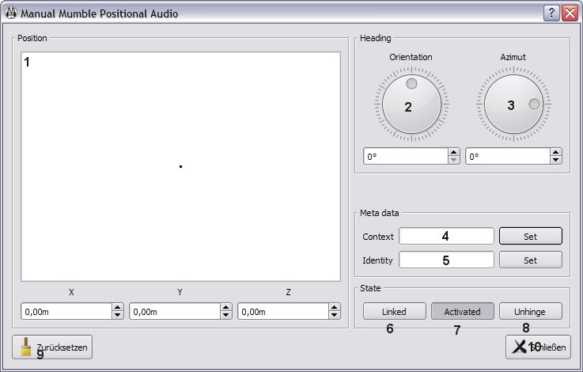

In addition to the mentioned plugins, there is a special plugin called manual placement plugin. It does not require a
game. Instead you can configure the plugin itself to set your own position from which other people in the same channel
who set up the same context can hear you.

1. Set yourself on the canvas from where others should hear you. Make sure to choose a position other than 0, 0, 0 or
   you won't hear or send positionally.
2. Set your own orientation where you want your virtual avatar to look at on a 360° Scale.
3. Set your own azimuth (if you look up or down while you talk).
4. Set the context of your avatar. Only the people with the same context will hear you positionally.
5. Set the identity.
6. Link or unlink the plugin to transfer the settings to the server for processing.
7. Enable or disable the plugin.
8. Separate the plugin settings window. This is useful to change the positional audio settings without keeping the
   Mumble settings window opened.
9. Reset values for all settings.
10. Close the window.
